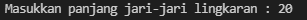

# Program menghitung luas lingkaran &
 Program menghitung keliling lingkaran 
## Bahasa program yang di gunakan
[Python](https://www.python.org)
### Flowchart luas lingkaran

### Penjelasan code program

- Baris 1: mendeklarasikan variable phi dengan nilai 3.14

- Baris 2: mendeklarasikan variable r serta memasukkan nilai jari-jari lingkaran bertipe float yang didapat dari user.

- Baris 3: mendeklarasikan variable luas dimana nilai variable tersebut didapat dari perhitungan luas, dimana nilai variable phi dikali nilai variable r lalu dikali dengan variable r dan hasilnya akan dimasukkan ke dalam variable luas.

- Baris 4: menampilkan nilai dari variable luas.

### Run program

Hasil program menghitung luas lingkaran

### contoh Inputan :

### contoh Keluaran :

### Kesimpulan 
Dari hasil program, source code program menghitung luas lingkaran dengan bahasa python tersebut berhasil dapat di compile dan dijalankan tanpa ada error dan saat panjang jari-jari diinput 20 maka menampilkan hasil perhitungan luas lingkaran yaitu 1256,0.

## Terima Kasih
