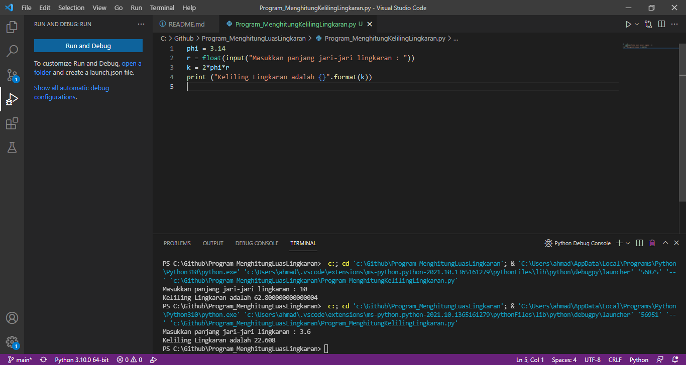

# Program menghitung luas lingkaran &
 Program menghitung keliling lingkaran 
## Bahasa program yang di gunakan
[Python](https://www.python.org)
## Program menghitung luas lingkaran
### Flowchart luas lingkaran

### Penjelasan code program

- Baris 1: mendeklarasikan variable phi dengan nilai 3.14

- Baris 2: mendeklarasikan variable r serta memasukkan nilai jari-jari lingkaran bertipe float yang didapat dari user.

- Baris 3: mendeklarasikan variable luas dimana nilai variable tersebut didapat dari perhitungan luas, dimana nilai variable phi dikali nilai variable r lalu dikali dengan variable r dan hasilnya akan dimasukkan ke dalam variable luas.

- Baris 4: menampilkan nilai dari variable luas.

### Run program

Hasil program menghitung luas lingkaran

### contoh Inputan :

### contoh Keluaran :

### Kesimpulan 
Dari hasil program, source code program menghitung luas lingkaran dengan bahasa python tersebut berhasil dapat di compile dan dijalankan tanpa ada error dan saat panjang jari-jari diinput 20 maka menampilkan hasil perhitungan luas lingkaran yaitu 1256,0.

## Program mehitung keliling lingkaran
### Flowchart keliling lingkaran

### Penjelasan kode program

- Baris 1: mendeklarasikan variable phi dengan nilai 3.14

- Baris 2: mendeklarasikan dan melakukan input nilai jari-jari lingkaran bertipe float ke dalam variable r.

- Baris 3: Perhitungan keliling dimana 2 dikali dengan nilai variable phi dikali nilai variable r dan hasilnya akan dimasukkan ke dalam varible k.

- Baris 4: menampilkan nilai dari variable k.

### Run program

### contoh inputan

### contoh keluaran

### Kesimpulan
Dari hasil program, source code program menghitung keliling lingkaran dengan bahasa python tersebut berhasil dapat di compile dan dijalankan tanpa ada error dan saat panjang jari-jari diinput 20 maka menampilkan hasil perhitungan keliling lingkaran yaitu 125.60.

## Terima Kasih
